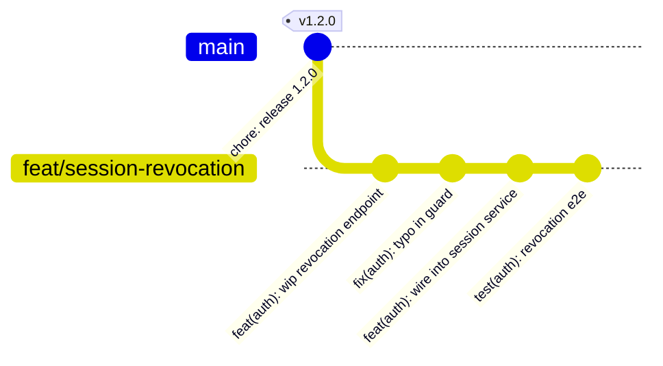
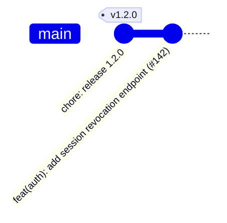
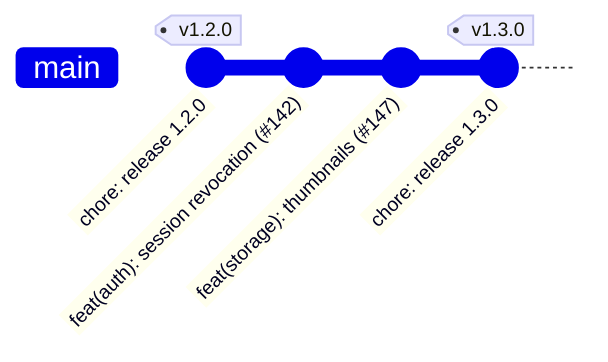
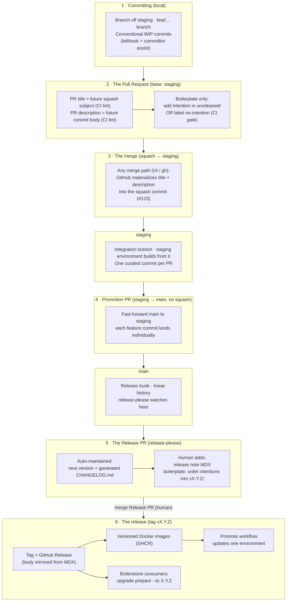

This page explains the reasoning behind our contribution and release system. The rules themselves live in [`CONTRIBUTING.md`](https://github.com/lonestone/grocery/blob/main/CONTRIBUTING.md), and the mechanics (versions, releases, deployments) are described in [Release and versioning](/grocery/references/1_release_and_versionning).

:::note[This project adds a `staging` integration branch]
The stock boilerplate merges every pull request straight to `main`. This project inserts one step: feature pull requests target **`staging`**, and `main` — the release trunk — moves forward only through a non-squash **promotion pull request** from `staging`. The `staging` deploy environment builds from the `staging` branch. The curation ceremony (WIP commits → one curated squash commit per pull request) is unchanged; it just happens on `staging` first. In the story below, read "merge to `main`" as "merge to `staging`, then promote to `main`". The rationale for the extra branch is in [Why this project adds a `staging` integration branch](#why-this-project-adds-a-staging-integration-branch).
:::

## The problem we are solving

Development has always fallen short on one thing: recording **why** a change was made. Commit messages stay short to be readable, so the rationale ends up in a pull request comment, a ticket, or a chat thread — if anywhere. A year later, someone reverts a change that was made for a good reason, simply because the reason is nowhere to be found.

AI agents change the economics here. Writing a clear commit message with a proper body used to be friction; now it is cheap. So we designed the system around one idea: **capture the "why" once, in the repository, at the moment the work is merged.**

## A week with the system

Before the rules, here is a normal week on a versioned project. Two developers, Pierrick and Nicolas. The project is at version `1.2.0`.

### Monday — Pierrick works

Pierrick builds session revocation on a branch cut from `staging`. He commits as he goes, through his agent. The commits are honest working notes — one is literally a typo fix. Each one passes commitlint (lefthook checks the format locally), but nobody polishes them. They will never reach `staging` or `main` as commits.



### Tuesday — Pierrick merges

The PR title is `feat(auth): add session revocation endpoint` — CI checked that it is a valid conventional header, because this title is about to become permanent. When the PR is ready, Pierrick tells his agent "finalize this PR". The agent — following the `finalize-pr` skill, on Pierrick's machine — reads the full diff and writes the **PR description** as the future commit body: a short paragraph on *why* revocation uses tombstone checks instead of session deletes. Nothing else — no screenshots, no checklist; review chatter lives in comments. A CI check lints the description and goes green.

Then anyone can merge, from anywhere — into `staging`. The repository is configured so the squash commit message is *always* "PR title + PR description" — the GitHub merge button, `gh`, and auto-merge all produce the same curated commit. There is no message to compose at merge time, so there is no way to fumble it. Pierrick clicks the button. The branch dies. The four WIP subjects do **not** ride along — "wip endpoint" and "typo in guard" tell a future reader nothing the diff and the rationale don't.

`staging` now has **one** new commit, and the staging environment redeploys:



The Release PR does not move yet — release-please watches `main`, and this commit is still on `staging`. It reaches `main` at the next promotion (see Friday), and only then does the Release PR pick it up.

### Wednesday — Nicolas merges

Nicolas ships thumbnail generation. While testing, he also fixed a real pagination bug — a second, unrelated, consumer-visible change in the same PR. This is the curation call at the heart of the system: out of his five working commits, exactly **two** deserve to exist afterwards. At finalization his agent writes the PR title for the first and puts one conventional paragraph for the second in the description, dropping the rest.

The squash commit message looks like this (abbreviated):

```
feat(storage): add image thumbnail generation (#147)

Thumbnails are generated at upload time rather than on-the-fly because
the S3 bucket is not fronted by a CDN yet; …

fix(api): correct off-by-one in list endpoint pagination
```

His squash commit lands on `staging` too. Two feature commits now sit on `staging`, ahead of `main`.

Meanwhile, staging has been redeployed on every merge. Production hasn't moved — it runs a pinned image, and there is no new version to promote yet.

### Friday — Pierrick releases

The client validated the features on staging; Pierrick decides to ship. First he promotes: he opens a `staging` → `main` pull request and merges it **without squashing**, so both feature commits land on `main` individually (`main` fast-forwards to `staging`). Now the Release PR wakes up — release-please reads the two new commits, proposes `1.3.0` (two feats and a fix is a minor), and regenerates `CHANGELOG.md` with **three** lines: revocation, thumbnails, and the pagination fix. Two of them link to the same commit `#147`; that's fine, the fix was declared as its own change.

His remaining work is the human part: he writes the release note (`releases/v1.3.0.mdx` in the docs app) — a few sentences on why this release exists and what it changes for users. A CI check can make this note mandatory; the boilerplate repository enforces it. He merges the Release PR.

Release-please tags `v1.3.0`, creates the GitHub Release (its body mirrored from the MDX), and the tag triggers the Docker build: images `1.3.0`, `1.3`, `latest` land in GHCR. Production still hasn't moved. Pierrick runs the **Promote** workflow from GitHub, picks `production` and `1.3.0`, and Dokploy pulls that image.



Total hand-written material for the whole cycle: two squash bodies and one release note. Everything else — version number, changelog, tag, GitHub Release, images, deploys — was derived. And every "why" is one `git show` away, forever.

## Everything durable lives in the repository

What should still be true in a year must live in files and git history — not in pull requests, GitHub Releases, or any other platform surface. Files and git are easily reachable for both humans and agents, while platform data needs an API and dies if we ever move away from the platform.

GitHub is welcome as an **editing venue** and a **mirror**, but it is never the source of truth. A pull request description is a pencil; the squash commit is the paper.

## Commits are the source of truth

We squash-merge every pull request, so the squash commit message is the one hand-written artifact per pull request. Everything else derives from it:

| Zoom | Artifact | Who writes it | What it holds |
| --- | --- | --- | --- |
| Implementation | Squash commit message | Human-guided, at pull request finalization | What changed and **why** |
| Inventory | `CHANGELOG.md` | Generated | One line per change, links to commits |
| Release | Note in `apps/documentation/src/content/docs/releases/` | Human (often agent-drafted) | Why this release exists |

The rationale is written **once**, in the commit body. The changelog does not copy it — it links to the commit, and `git show` is one hop away. A second copy would drift.

### What the release tooling reads

release-please parses the squash commit message with precise rules. Knowing them explains several of our conventions:

- The **subject line** is parsed as a conventional commit: one changelog entry, counted in the version math.
- A body **paragraph that starts unbulleted, after a blank line, with a standard type** (`fix(api): …`) is parsed as an *additional* change: its own changelog line, counted in the version. That is how one PR declares two changes.
- **Bulleted lines (`* fix: typo`) never match.** If GitHub's auto-generated commit list ever slips into a merge, it is invisible to the parser — a hygiene problem, not a versioning incident.
- The token `BREAKING-CHANGE:` matches **anywhere** in the body, even mid-sentence, and forces a major release. That is why our always-on agent rules warn about it: it is valid syntax that no linter can distinguish from prose.

## The decisions and why

### Why squash merges

A linear history makes it much easier to pinpoint the commit that introduced an issue, and it is what [release-please](https://github.com/googleapis/release-please) recommends to parse changes reliably. It also turns the pull request into a natural unit of work: however messy the WIP commits were, what lands is a single, well-written commit — which also makes cherry-picking trivial when it is ever needed.

The stock boilerplate stops there: one trunk, `main`, and every pull request squash-merges onto it. The "stable line" that a `develop`/`main` pair tries to model already exists as the tag list, and release-please assumes a single trunk.

### Why this project adds a `staging` integration branch

The boilerplate's single-trunk model asks every merge to be release-ready, because every merge *is* on the release trunk. This project wants a place to integrate and validate several features together — on a real deployed environment, in front of the cooperative — before any of it counts toward a release. So `staging` is a genuine branch, not just an environment pointer: feature pull requests land there (same squash ceremony, same curated commit), the `staging` environment builds from it, and a **non-squash** promotion pull request fast-forwards `main` to `staging` when the batch is validated.

The promotion is deliberately not a squash: `main` must receive each feature's curated commit individually, or release-please loses the per-change granularity it needs for the changelog and the version math. Because `staging` only ever runs ahead of `main`, the promotion is always a fast-forward — `main` stays exactly as linear as the single-trunk model, just one step behind `staging`.

### Why the WIP-to-squash transformation happens before the merge click

The naive design — compose the squash message at merge time — fails in practice: most people merge from the GitHub UI, and a message typed in a text box at click time is unreviewed and easy to fumble. So finalization is moved **off the merge click** entirely. The repository setting "default squash message = PR title and description" means GitHub materializes the curated text into the commit no matter who merges or how. CI lints the title and description before merge, which makes the future `git log` entry **reviewable**: reviewers can request changes on the wording of the rationale like on code.

This is also why no merge bot is needed — correctness comes from the repo setting plus the CI gate, not from who clicks.

### Why standard commit types only

We use the standard Conventional Commits types (`feat`, `fix`, `docs`, `refactor`, …) and nothing custom. Fewer rules to teach — and release-please's parser only recognizes the standard list, so a custom type in an extra body paragraph would silently not count as a change.

Commit **scopes** are the project's domains, defined once in `commitlint.config.ts`. Everything else (docs, skills, workflows) points to that file and never restates the list, because two copies drift. A consumer project personalizes its scopes by editing that one array.

### Why we let a tool write the changelog

We used to forbid generated changelogs. That rule predates agent-written commits: back then, generation meant compiling messy WIP subjects into noise. With curated squash messages, the generated changelog *is* the curated inventory — the granularity is decided by the author (one paragraph per change) and the reasons live in commit bodies, one link away. The two arguments for hand-curation disappeared, so the rule did too.

### Why the Release PR rebases on every push

release-please's default is to update the Release PR only when the generated changelog would change. Hidden types (`ci`, `chore`, `test`, `style`, `build`) never change that changelog, so a CI gate merged to `main` would leave the Release PR on a stale snapshot — new checks would not even run on it.

That default is correct for a PR that is only a generated version bump. Ours is also a working branch (promote intentions, bump the example version). It has to stay on top of `main`. `always-update` is the first-party switch for that: every push rebases the PR. The cost is a force-push, so extra commits on the Release PR are dropped when `main` moves. Promote last; merge before the next push. See the [release maintainer runbook](https://github.com/lonestone/grocery/blob/main/.boilerstone/docs/release-maintainer-runbook.md#working-the-release-pr).

The same config sets the Release PR title to `chore(ci): release X.Y.Z`. The default title uses the branch name as scope (`chore(main): …`), which is not a domain in `commitlint.config.ts`, so PR lint would block the merge.

### Why release notes live in the docs app

A changelog line cannot say "these five PRs together deliver X" — that context spans commits and partly lives outside the repo. So each release gets a human-written note in `apps/documentation/src/content/docs/releases/`, and the GitHub Release body is a **mirror** of it, not the other way around. The docs app publishes to GitHub Pages, so release notes double as public product communication. Notes are optional by default and enforced per repository — see [Release and versioning](/grocery/references/1_release_and_versionning#changelog-and-release-notes).

### Why a human merges the Release PR

We considered auto-merging the Release PR when its checks are green, and rejected it. Green checks mean the PR is *allowed* to merge, not that the team wants this bundle released. A project that wants every merge in production should simply stay in the "without versions" mode rather than automate away the one human gate that versioning exists to provide.

What *can* be automated is everything after that click: with [`PROMOTE_ON_RELEASE`](/grocery/references/1_release_and_versionning#promote-automatically-on-release), merging the Release PR chains straight into the deploy — optionally pausing on a GitHub "Approve and deploy" button when the environment has required reviewers. The gate moves to a better place; it does not disappear.

### Why only `staging` owns a branch, and `production` does not

The classic git-flow mistake is one branch per environment: merging into `staging` deploys staging, merging into `main` deploys production, and both branches slowly become workspaces — a hotfix lands on one and not the other, and the history stops telling the truth.

This project keeps exactly one integration branch, `staging`, and treats it as a workspace *on purpose* — that is its whole job, a place to assemble and validate a batch before it becomes releasable. What it does **not** do is let `staging` diverge from `main`: promotion is always a fast-forward, so the two branches never carry different versions of the same change. `production` owns no branch at all — it runs a pinned version tag, promoted explicitly. `main` produces artifacts (builds, images, tags); the `staging` branch produces the staging build; the release tags feed production. If another host really needs a branch to watch for production, a `deploy/production` branch can exist as a **fast-forwarded pointer** to a tag — never a workspace, never committed to directly.

### Why lefthook rather than husky

Single binary, one `lefthook.yml`, parallel hooks, no `prepare`-script coupling. Functionally equivalent for our need — a taste call, but a deliberate one.

### Why feature flags before cherry-picks

The recurring "client wants B without A" problem (both merged, A must not ship) is solved by a feature flag first: A merges but ships dark. See [Feature flags](/grocery/guides/feature-flags). The escape hatch — branch from the last tag, cherry-pick B's squash commit, cut a patch release — is easy precisely because squash merge gives one commit per PR. And the release gate itself removes most other cherry-picking: merging no longer means deploying.

## The full flow



## Boilerplate vs consumer

The same system runs in both places, with a few producer-only pieces:

| Piece | Boilerplate repo | Consumer project |
| --- | --- | --- |
| Conventional commits, commitlint, lefthook | ✔ | ✔ (edits the scopes array) |
| PR title + description lint | ✔ | ✔ |
| Intention gate (`unreleased/` or `no-intention` label) | ✔ | ✘ (no intention machinery) |
| release-please | ✔, versioned | Optional: off (without versions) or on |
| Generated `CHANGELOG.md` | ✔ | ✔ when versioned |
| Release notes in the docs app | ✔ (enforced) | ✔ when versioned (opt-in enforcement) |
| Release-time intention plumbing on the Release PR | ✔ | ✘ |
| Tag-triggered GHCR images | ✔ | Recommended when versioned |
| Promote workflow | optional | Recommended when versioned and Dokploy pulls images |
| `CONTRIBUTING.md` | ✔ | ✔ shipped; personalize scopes via `commitlint.config.ts` |
| GitHub settings script | ✔ | ✔ (run once at project setup) |

On the boilerplate repository, a PR that changes something consumers must adapt to also carries its **migration intention** — written in the same PR, by the author who has the context, not reconstructed at release time by the maintainer. The maintainer's job on the Release PR is plumbing: ordering the staged intentions and checking staleness. The human release note can be drafted earlier, on a regular PR, so the story is written while the work is still fresh. See the [release maintainer runbook](https://github.com/lonestone/grocery/blob/main/.boilerstone/docs/release-maintainer-runbook.md).

## Built for agents

The team commits mostly through agents, so the system makes agents correct **by construction** rather than by hoping they read the docs. Four layers, ordered by reliability:

1. **Guardrails**: commitlint locally, PR lint / intention gate / release-note check in CI. Every rejection message states the fix — error messages are prompts.
2. **One canon per stage, never restated**: `CONTRIBUTING.md` for commits and PRs, the runbook for boilerplate releases, the [Release and versioning](/grocery/references/1_release_and_versionning) page for versioning and deploys. Skills and rules point to these documents; duplicating them would drift.
3. **Two always-on rule lines, no more** (always-on context is a budget): read `CONTRIBUTING.md` before committing, and never write `BREAKING-CHANGE:` unless you mean it.
4. **Skills for ceremonies only** (`finalize-pr`, `project-release`, `boilerstone-intention`, `boilerstone-release`): multi-step, occasional procedures. There is deliberately no `commit` skill — committing happens dozens of times a day, and commitlint's corrective errors teach faster than prose.
