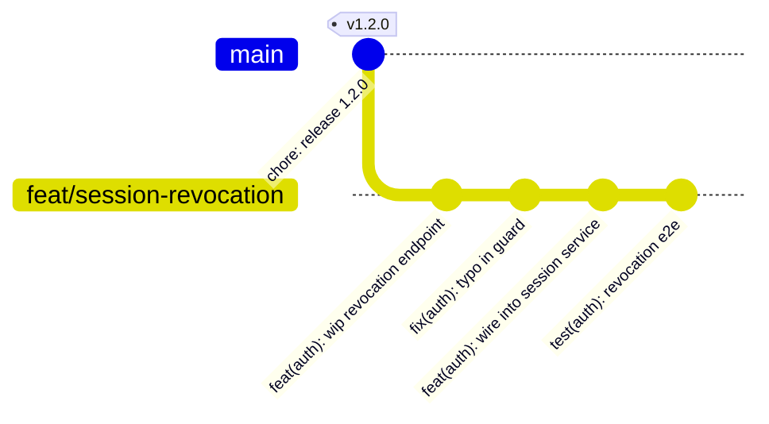
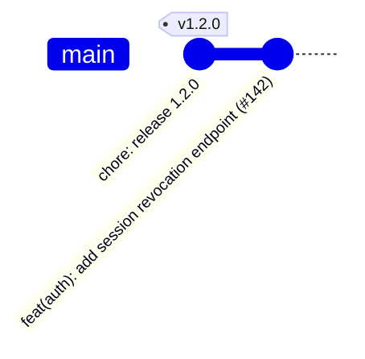
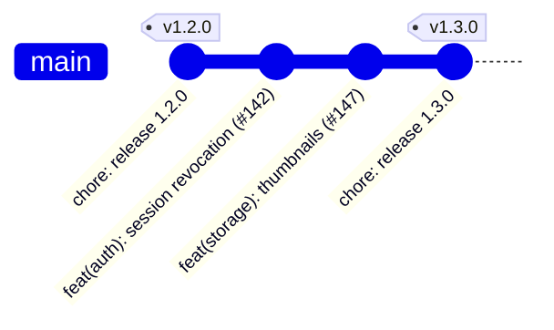
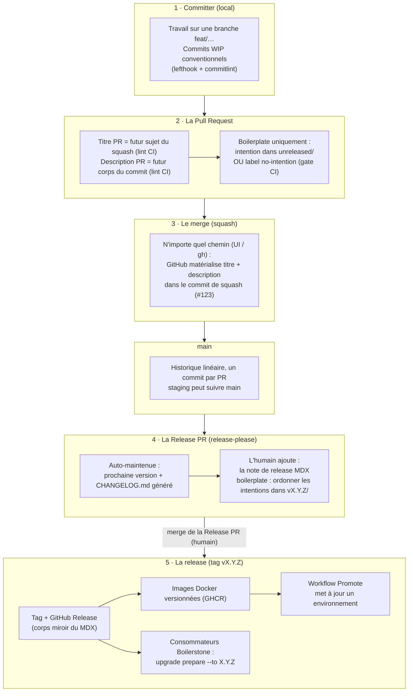

Cette page explique le raisonnement derrière notre système de contribution et de release. Les règles elles-mêmes vivent dans [`CONTRIBUTING.md`](https://github.com/lonestone/lonestone-boilerplate/blob/main/CONTRIBUTING.md), et la mécanique (versions, releases, déploiements) est décrite sur [Release et versionnement](/lonestone-boilerplate/fr/references/1_release_and_versionning).

## Le problème que nous résolvons

Le développement a toujours péché sur un point : consigner **pourquoi** un changement a été fait. Les messages de commit restent courts pour être lisibles, alors la justification finit dans un commentaire de pull request, un ticket ou un fil de discussion — quand elle existe. Un an plus tard, quelqu'un annule un changement fait pour une bonne raison, simplement parce que la raison n'était écrite nulle part.

Les agents IA changent l'équation. Écrire un message de commit clair avec un vrai corps était une friction ; c'est devenu bon marché. Nous avons donc conçu le système autour d'une idée : **capturer le « pourquoi » une seule fois, dans le dépôt, au moment où le travail est mergé.**

## Une semaine avec le système

Avant les règles, voici une semaine normale sur un projet versionné. Deux développeurs, Pierrick et Nicolas. Le projet est en version `1.2.0`.

### Lundi — Pierrick travaille

Pierrick développe la révocation de session sur une branche. Il committe au fil de l'eau, via son agent. Les commits sont des notes de travail honnêtes — l'un d'eux est littéralement une correction de faute de frappe. Chacun passe commitlint (lefthook vérifie le format en local), mais personne ne les peaufine. Ils n'atteindront jamais `main` en tant que commits.



### Mardi — Pierrick merge

Le titre de la PR est `feat(auth): add session revocation endpoint` — la CI a vérifié que c'est un en-tête conventionnel valide, car ce titre est sur le point de devenir permanent. Quand la PR est prête, Pierrick dit à son agent « finalise cette PR ». L'agent — en suivant le skill `finalize-pr`, sur la machine de Pierrick — lit le diff complet et rédige la **description de la PR** comme futur corps du commit : un court paragraphe sur le *pourquoi* la révocation utilise des vérifications de type tombstone plutôt que des suppressions de session. Rien d'autre — pas de captures d'écran, pas de checklist ; les échanges de review vivent dans les commentaires. Un check CI valide la description et passe au vert.

Ensuite, n'importe qui peut merger, depuis n'importe où. Le dépôt est configuré pour que le message du commit de squash soit *toujours* « titre de la PR + description de la PR » — le bouton de merge GitHub, `gh` et l'auto-merge produisent tous le même commit soigné. Il n'y a aucun message à composer au moment du merge, donc aucun moyen de le rater. Pierrick clique sur le bouton. La branche meurt. Les quatre sujets WIP ne suivent **pas** — « wip endpoint » et « typo in guard » n'apprennent rien à un futur lecteur que le diff et la justification ne disent déjà.

`main` a maintenant **un** nouveau commit :



Quelques minutes plus tard, une PR de bot apparaît (ou se met à jour) : la **Release PR**, maintenue par release-please. Elle lit le nouveau commit, propose la version `1.3.0` (un `feat` signifie un bump mineur), et régénère `CHANGELOG.md` avec une ligne — « add session revocation endpoint », liée au commit `#142`. Personne ne la merge. Elle reste là, toujours à jour.

### Mercredi — Nicolas merge

Nicolas livre la génération de miniatures. Pendant ses tests, il a aussi corrigé un vrai bug de pagination — un second changement visible par les consommateurs, sans rapport, dans la même PR. C'est le choix de curation au cœur du système : sur ses cinq commits de travail, exactement **deux** méritent d'exister ensuite. À la finalisation, son agent écrit le titre de la PR pour le premier, met un paragraphe conventionnel pour le second dans la description, et abandonne le reste.

Le message du commit de squash ressemble à ceci (abrégé) :

```
feat(storage): add image thumbnail generation (#147)

Thumbnails are generated at upload time rather than on-the-fly because
the S3 bucket is not fronted by a CDN yet; …

fix(api): correct off-by-one in list endpoint pagination
```

La Release PR se met à jour à nouveau : toujours `1.3.0` (deux feats et un fix restent un mineur), mais le changelog affiche maintenant **trois** lignes — révocation, miniatures et le fix de pagination. Deux d'entre elles pointent vers le même commit `#147` ; c'est normal, le fix a été déclaré comme un changement à part entière.

Pendant ce temps, staging a été redéployé à chaque merge. La production n'a pas bougé — elle tourne une image épinglée, et il n'y a pas encore de nouvelle version à promouvoir.

### Vendredi — Pierrick publie

Le client a validé les fonctionnalités sur staging ; Pierrick décide de livrer. Il ouvre la Release PR — le bump de version et le changelog sont déjà là. Son travail restant est la partie humaine : il rédige la note de release (`releases/v1.3.0.mdx` dans l'app de documentation) — quelques phrases sur pourquoi cette release existe et ce qu'elle change pour les utilisateurs. Un check CI peut rendre cette note obligatoire ; le dépôt du boilerplate l'impose. Il merge.

Release-please pose le tag `v1.3.0`, crée la GitHub Release (son corps est un miroir du MDX), et le tag déclenche le build Docker : les images `1.3.0`, `1.3`, `latest` arrivent sur GHCR. La production n'a toujours pas bougé. Pierrick lance le workflow **Promote** depuis GitHub, choisit `production` et `1.3.0`, et Dokploy tire cette image.



Total du contenu écrit à la main sur tout le cycle : deux corps de squash et une note de release. Tout le reste — numéro de version, changelog, tag, GitHub Release, images, déploiements — a été dérivé. Et chaque « pourquoi » est à un `git show` de distance, pour toujours.

## Tout ce qui est durable vit dans le dépôt

Ce qui doit encore être vrai dans un an doit vivre dans des fichiers et dans l'historique git — pas dans les pull requests, les GitHub Releases, ni aucune autre surface de plateforme. Les fichiers et git sont trivialement accessibles pour les humains comme pour les agents ; les données de plateforme demandent de la plomberie d'API et meurent si on change de plateforme.

GitHub est bienvenu comme **lieu d'édition** et comme **miroir**, mais il n'est jamais la source de vérité. Une description de pull request est un crayon ; le commit de squash est le papier.

## Les commits sont la source de vérité

Nous mergeons chaque pull request en squash : le message du commit de squash est le seul artefact écrit à la main par PR. Tout le reste en dérive :

| Niveau de zoom | Artefact | Écrit par | Contient |
| --- | --- | --- | --- |
| Implémentation | Message du commit de squash | Agent guidé par un humain, à la finalisation de la PR | Ce qui a changé et **pourquoi** |
| Inventaire | `CHANGELOG.md` | Généré | Une ligne par changement, liens vers les commits |
| Release | Note dans `apps/documentation/src/content/docs/releases/` | Humain (souvent un brouillon d'agent) | Pourquoi cette release existe |

La justification est écrite **une seule fois**, dans le corps du commit. Le changelog ne la duplique pas — il pointe vers le commit, et `git show` est à un saut de distance. Une seconde copie dériverait.

### Ce que l'outillage de release lit

release-please analyse le message du commit de squash avec des règles précises. Les connaître explique plusieurs de nos conventions :

- La **ligne de sujet** est analysée comme un commit conventionnel : une entrée de changelog, comptée dans le calcul de version.
- Un **paragraphe du corps qui commence sans puce, après une ligne vide, par un type standard** (`fix(api): …`) est analysé comme un changement *supplémentaire* : sa propre ligne de changelog, comptée dans la version. C'est ainsi qu'une PR déclare deux changements.
- **Les lignes à puces (`* fix: typo`) ne matchent jamais.** Si la liste de commits auto-générée par GitHub se glisse un jour dans un merge, elle est invisible pour le parseur — un problème d'hygiène, pas un incident de versionnement.
- Le token `BREAKING-CHANGE:` matche **n'importe où** dans le corps, même au milieu d'une phrase, et force une release majeure. C'est pourquoi nos règles d'agents toujours actives en avertissent : c'est une syntaxe valide qu'aucun linter ne peut distinguer de la prose.

## Les décisions et leurs raisons

### Pourquoi le squash merge, et pas de branche `develop`

Un historique linéaire rend beaucoup plus facile de retrouver le commit qui a introduit un problème, et c'est ce que [release-please](https://github.com/googleapis/release-please) recommande pour analyser les changements de façon fiable. Il fait aussi de la pull request une unité de travail naturelle : aussi brouillons que soient les commits WIP, ce qui atterrit sur `main` est un seul commit bien écrit — ce qui rend d'ailleurs le cherry-pick trivial quand il est un jour nécessaire.

Nous avons longtemps utilisé git-flow, donc abandonner `develop` est un choix délibéré : la « ligne stable » que les paires `develop`/`main` essaient de modéliser existe déjà — c'est la liste des tags. Les consommateurs n'installent jamais depuis une branche, l'outillage de release suppose un tronc unique, et git-flow résout des trains de release parallèles que nous n'avons pas à notre taille d'équipe.

### Pourquoi la transformation WIP → squash se joue avant le clic de merge

Le design naïf — composer le message du squash au moment du merge — échoue en pratique : la plupart des gens mergent depuis l'interface GitHub, et un message tapé dans une boîte de texte au moment du clic n'est ni relu ni fiable. La finalisation est donc déplacée **hors du clic de merge**. Le réglage du dépôt « message de squash par défaut = titre + description de la PR » fait que GitHub matérialise le texte soigné dans le commit, peu importe qui merge et comment. La CI vérifie le titre et la description avant le merge, ce qui rend la future entrée de `git log` **reviewable** : les reviewers peuvent demander des changements sur la formulation de la justification comme sur du code.

C'est aussi pourquoi aucun bot de merge n'est nécessaire — la justesse vient du réglage du dépôt plus la gate CI, pas de qui clique.

### Pourquoi uniquement les types de commits standards

Nous utilisons les types standards de Conventional Commits (`feat`, `fix`, `docs`, `refactor`, …) et rien de personnalisé. Moins de règles à apprendre — et le parseur de release-please ne reconnaît que la liste standard : un type personnalisé dans un paragraphe supplémentaire ne compterait silencieusement pas comme un changement.

Les **scopes** des commits sont les domaines du projet, définis une seule fois dans `commitlint.config.ts`. Tout le reste (docs, skills, workflows) pointe vers ce fichier et ne recopie jamais la liste, parce que deux copies dérivent. Un projet consommateur personnalise ses scopes en éditant ce seul tableau.

### Pourquoi nous laissons un outil écrire le changelog

Nous interdisions les changelogs générés. Cette règle date d'avant les commits écrits par agents : à l'époque, générer voulait dire compiler des sujets WIP brouillons en bruit. Avec des messages de squash soignés, le changelog généré *est* l'inventaire soigné — la granularité est décidée par l'auteur (un paragraphe par changement) et les raisons vivent dans les corps de commits, à un lien de distance. Les deux arguments pour la curation manuelle ont disparu, la règle aussi.

### Pourquoi la Release PR se rebase à chaque push

Par défaut, release-please ne met à jour la Release PR que si le changelog généré changerait. Les types masqués (`ci`, `chore`, `test`, `style`, `build`) ne changent jamais ce changelog : un check CI mergé sur `main` laisserait donc la Release PR sur un instantané périmé — les nouveaux checks ne s'y exécuteraient même pas.

Ce défaut est correct pour une PR qui n'est qu'un bump de version généré. La nôtre est aussi une branche de travail (promouvoir les intentions, mettre à jour la version d'exemple). Elle doit rester au-dessus de `main`. `always-update` est l'option officielle pour ça : chaque push rebase la PR. Le coût est un force-push, donc les commits extra sur la Release PR disparaissent quand `main` avance. Promouvoir en dernier ; merger avant le push suivant. Voir le [runbook du mainteneur de release](https://github.com/lonestone/lonestone-boilerplate/blob/main/.boilerstone/docs/release-maintainer-runbook.md#working-the-release-pr).

La même config fixe le titre de la Release PR à `chore(ci): release X.Y.Z`. Le titre par défaut utilise le nom de branche comme scope (`chore(main): …`), qui n'est pas un domaine dans `commitlint.config.ts`, donc le lint de PR bloquerait le merge.

### Pourquoi les notes de release vivent dans l'app de documentation

Une ligne de changelog ne peut pas dire « ces cinq PR ensemble livrent X » — ce contexte traverse les commits et vit en partie hors du dépôt. Chaque release reçoit donc une note humaine dans `apps/documentation/src/content/docs/releases/`, et le corps de la GitHub Release en est un **miroir**, pas l'inverse. L'app de documentation est publiée sur GitHub Pages, donc les notes de release servent aussi de communication produit publique. Les notes sont optionnelles par défaut et imposées par dépôt — voir [Release et versionnement](/lonestone-boilerplate/fr/references/1_release_and_versionning#changelog-et-notes-de-release).

### Pourquoi un humain merge la Release PR

Nous avons envisagé de merger automatiquement la Release PR quand ses checks sont verts, et nous avons rejeté l'idée. Des checks verts signifient que la PR a le *droit* de merger, pas que l'équipe veut publier ce lot. Un projet qui veut chaque merge en production devrait simplement rester en mode « sans versions » plutôt que d'automatiser la seule porte humaine que le versionnement existe à fournir.

Ce qui *peut* être automatisé, c'est tout ce qui suit ce clic : avec [`PROMOTE_ON_RELEASE`](/lonestone-boilerplate/fr/references/1_release_and_versionning#promouvoir-automatiquement-à-la-release), merger la Release PR enchaîne directement sur le déploiement — avec, en option, une pause sur un bouton GitHub « Approve and deploy » quand l'environnement a des required reviewers. La porte se déplace au bon endroit ; elle ne disparaît pas.

### Pourquoi les environnements de déploiement ne possèdent pas de branche

Nous avons longtemps utilisé des branches d'environnement à la git-flow : merger dans `staging` déployait staging, merger dans `main` déployait la production. Ça fonctionne, mais les branches deviennent lentement des espaces de travail — un hotfix atterrit sur une branche et pas l'autre, et l'historique cesse de dire la vérité.

Dans ce système, aucun environnement ne possède de branche. `main` produit des artefacts (builds, images, tags) et chaque environnement pointe vers un flux d'artefacts — lequel est un choix par environnement, décrit sur [Release et versionnement](/lonestone-boilerplate/fr/references/1_release_and_versionning). Si un hébergeur exige vraiment une branche à surveiller, une branche `deploy/<env>` peut exister comme **pointeur avancé en fast-forward** vers un tag — jamais un espace de travail, jamais de commit direct. C'est une échappatoire, pas le défaut.

### Pourquoi lefthook plutôt que husky

Un seul binaire, un seul `lefthook.yml`, des hooks parallèles, pas de couplage au script `prepare`. Fonctionnellement équivalent pour notre besoin — une question de goût, mais assumée.

### Pourquoi les feature flags avant les cherry-picks

Le problème récurrent « le client veut B sans A » (les deux mergés, A ne doit pas partir) se résout d'abord par un feature flag : A merge mais reste éteint. Voir [Feature flags](/lonestone-boilerplate/fr/guides/feature-flags). L'échappatoire — brancher depuis le dernier tag, cherry-picker le commit de squash de B, sortir un patch — est facile précisément parce que le squash merge donne un commit par PR. Et la porte de release elle-même supprime la plupart des autres cherry-picks : merger ne veut plus dire déployer.

## Le flux complet



## Boilerplate vs consommateur

Le même système tourne des deux côtés, avec quelques pièces réservées au producteur :

| Pièce | Dépôt boilerplate | Projet consommateur |
| --- | --- | --- |
| Conventional commits, commitlint, lefthook | ✔ | ✔ (édite le tableau des scopes) |
| Lint du titre + description de PR | ✔ | ✔ |
| Gate d'intention (`unreleased/` ou label `no-intention`) | ✔ | ✘ (pas de machinerie d'intentions) |
| release-please | ✔, versionné | Optionnel : off (sans versions) ou on |
| `CHANGELOG.md` généré | ✔ | ✔ si versionné |
| Notes de release dans l'app de docs | ✔ (imposées) | ✔ si versionné (imposition opt-in) |
| Plomberie des intentions sur la Release PR | ✔ | ✘ |
| Images GHCR déclenchées par tag | ✔ | Recommandé si versionné |
| Workflow Promote | optionnel | Recommandé si versionné et Dokploy tire les images |
| `CONTRIBUTING.md` | ✔ | ✔ livré ; personnaliser les scopes via `commitlint.config.ts` |
| Script de réglages GitHub | ✔ | ✔ (une fois à la création du projet) |

Sur le dépôt du boilerplate, une PR qui change quelque chose que les consommateurs doivent adapter porte aussi son **intention de migration** — écrite dans la même PR, par l'auteur qui a le contexte, pas reconstruite à la release par le mainteneur. Le travail du mainteneur sur la Release PR est de la plomberie : ordonner les intentions en attente et vérifier leur fraîcheur. La note de release humaine peut être rédigée plus tôt, sur une PR normale, tant que le travail est encore frais. Voir le [runbook du mainteneur de release](https://github.com/lonestone/lonestone-boilerplate/blob/main/.boilerstone/docs/release-maintainer-runbook.md).

## Conçu pour les agents

L'équipe committe surtout via des agents, donc le système rend les agents corrects **par construction** plutôt qu'en espérant qu'ils lisent la doc. Quatre couches, par ordre de fiabilité :

1. **Des garde-fous** : commitlint en local, lint de PR / gate d'intention / check de note de release en CI. Chaque message de rejet énonce le correctif — les messages d'erreur sont des prompts.
2. **Un canon par étape, jamais recopié** : `CONTRIBUTING.md` pour les commits et les PR, le runbook pour les releases du boilerplate, la page [Release et versionnement](/lonestone-boilerplate/fr/references/1_release_and_versionning) pour le versionnement et les déploiements. Les skills et les règles pointent vers ces documents ; les dupliquer les ferait dériver.
3. **Deux lignes de règles toujours actives, pas plus** (le contexte toujours actif est un budget) : lire `CONTRIBUTING.md` avant de committer, et ne jamais écrire `BREAKING-CHANGE:` sans le vouloir.
4. **Des skills pour les cérémonies uniquement** (`finalize-pr`, `project-release`, `boilerstone-intention`, `boilerstone-release`) : des procédures occasionnelles en plusieurs étapes. Il n'y a délibérément pas de skill `commit` — on committe des dizaines de fois par jour, et les erreurs correctives de commitlint enseignent plus vite que la prose.
