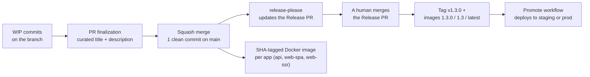
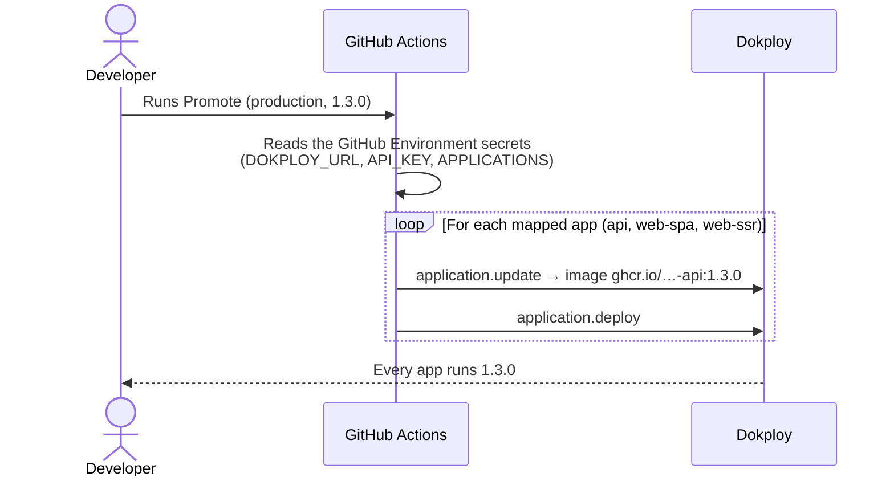
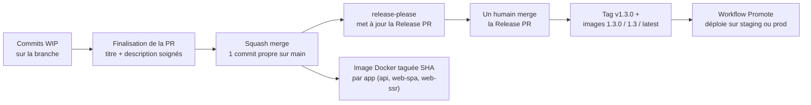
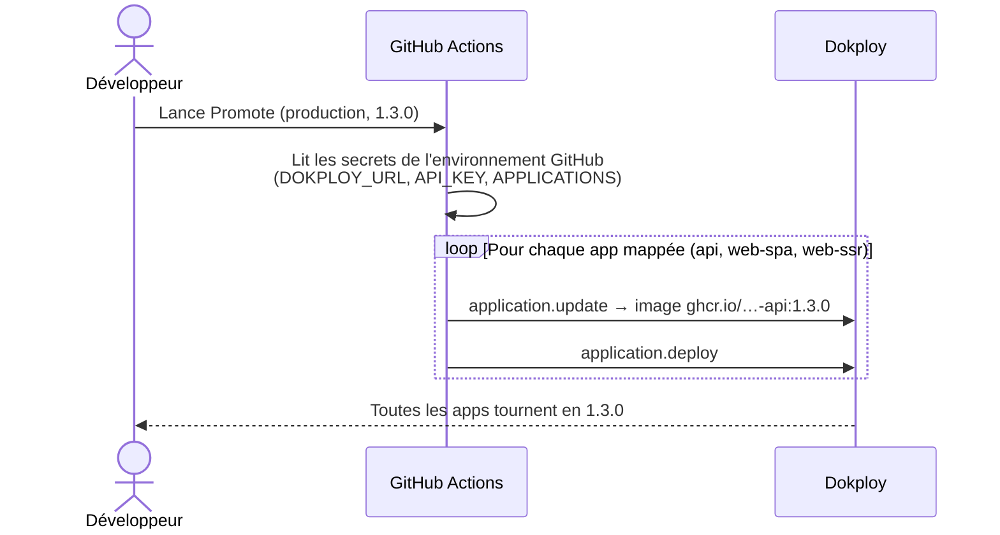

This release exists to give the boilerplate — and the projects that come from it — a complete path from writing a commit to deploying in production. Until now, the "why" of a change lived in a PR comment or a chat thread, and most projects had no notion of version: everything merged went to production at the same pace.

The idea is simple: **the squash commit message is the only thing written by hand. Everything else derives from it.**

The generated inventory is in [`CHANGELOG.md`](https://github.com/lonestone/lonestone-boilerplate/blob/main/CHANGELOG.md). The detailed "why" of every decision lives in [Contribution and release](/lonestone-boilerplate/explanations/2_contribution-and-release).

A French version of this note is [below](#version-française).

## The starting problem

Most of our projects work as "merge to `main` = deploy". That is fine early on, but it creates three problems as a project matures:

1. **The "why" of changes gets lost.** Commit messages are short, the justification lives in a PR comment or a Slack thread. A year later, someone reverts a change made for a good reason, because the reason was written nowhere.
2. **No notion of version.** Impossible to say "production runs 1.2.3", to build a clean changelog, or to plug tools like Sentry into releases.
3. **No gate between staging and production.** Everything merged goes to production, at the same pace.

## How it works

Every PR is squash-merged: a single clean commit lands on `main`, with a normalized title (Conventional Commits) and a body that explains the why. From there, everything is automatic: version math, changelog, Docker images.

## The pieces, one by one

### 1. Written and enforced contribution rules

- **[`CONTRIBUTING.md`](https://github.com/lonestone/lonestone-boilerplate/blob/main/CONTRIBUTING.md)**: the reference document. Commit format (Conventional Commits 1.0.0), PR title and description format, squash merge flow.
- **commitlint + lefthook**: every commit message is checked locally at commit time (lefthook replaces husky). The allowed scopes are the project's domains, defined in `commitlint.config.ts`.
- **PR lint in CI** (`pr-lint.yml`): the PR title and description are checked before merge, including a hunt for words like "wip" or "fix stuff". Why? Because with squash merge, **the PR title becomes the commit message** — it must be clean before anyone clicks the button.

### 2. Automatic versioning with release-please

- On every merge to `main`, [release-please](https://github.com/googleapis/release-please) maintains a **Release PR**: it accumulates changes, computes the next version (semver, from the commit types), and generates `CHANGELOG.md`.
- **We never edit `CHANGELOG.md` by hand again.** It is a generated inventory: one line per change, with a link to the commit. The why is in the commit body, one `git show` away.
- **The Release PR is merged by a human, never automatically.** Green checks mean "this PR is allowed to merge", not "send this to production". It is the release gate.
- On top of the changelog, each release can have a **human release note** in `apps/documentation/src/content/docs/releases/`: it tells why this version exists. The CI check (`release-note.yml`) is **optional by default**: it only blocks the Release PR when the repository variable `REQUIRE_RELEASE_NOTE` is `true`. The boilerplate enables it for itself; each project chooses.

### 3. Versioned Docker images for every app

The `push-to-ghcr.yml` workflow now builds one image per runnable app — **API, web-spa, and web-ssr** — not just the API. If a Dockerfile is missing (app removed from the project), it is simply skipped.

- A push to `main` produces a SHA-tagged image.
- A `v*` tag produces `1.3.0`, `1.3`, and `latest`.

All apps therefore move at the same version: no more situation where the API is versioned while the frontends build from a branch.

### 4. The Promote workflow: deploy a version in one click

Merging the Release PR publishes the tag and the images, **but deploys nothing**. Deploying is a separate step: the **Promote** workflow, run manually from GitHub (Actions → Promote → pick the environment and the version).

- Staging and production are two separate GitHub Environments: they move independently.
- We never change the version by hand in Dokploy anymore: the workflow run is the record of who promoted what, and when.
- The workflow is written for Dokploy; for another host, keep the same principle (one run = one environment updated) and adapt the API calls.
- Optional: set the repository variable `PROMOTE_ON_RELEASE` and Promote is dispatched automatically once the tag images are built — merging the Release PR becomes the deploy button. Add required reviewers on the environment to get an "Approve and deploy" pause instead of an immediate deploy.

### 5. The two modes: not every project has to version

| Mode | Commit checks | Release |
| --- | --- | --- |
| **Without versions** | commitlint only | does not exist — no Release PR |
| **Versioned** | commitlint + full semver | Release PR merged by a human, tag + versioned images |

A new project starts **without versions**: every merge goes to staging, which is what you want early on. When the project goes to production, you switch on the versioned mode — the release-please config files already ship with the template. The build pipeline is identical in both modes.

### 6. Migration intentions are written in the PR

On the Boilerstone side (the boilerplate upgrade system), migration intentions are no longer written at release time but **in the PR that introduces the change**, in `.boilerstone/migration-intentions/unreleased/`. The developer has the context; the maintainer releasing five PRs at once does not.

- A CI check (`intention-gate.yml`) requires either an intention file or the `no-intention` label (not every change concerns consumers).
- At release time, `pnpm boilerplate intentions promote` moves the staged intentions to their final location with the right identifiers.

### 7. Feature flags rather than cherry-picks

When two merged changes must not ship to production together, the answer is a feature flag, not a cherry-pick. This release adds a minimal convention: an `isFeatureEnabled` helper on the API side, driven by an environment variable, and a guide in the docs. Cherry-picking remains a documented escape hatch in the maintainer runbook.

### 8. Skills for AI agents

Four skills support the multi-step ceremonies, for Claude and Cursor alike:

- **finalize-pr**: turn WIP commits into a clean squash title + description.
- **project-release**: prepare a release on a consumer project (release note, check verification).
- **boilerstone-intention**: write the migration intention for the current PR.
- **boilerstone-release**: prepare a boilerplate release on the Release PR.

## What this means for the boilerplate

- The repo switches to **mandatory squash merge** with the PR title/description as the commit message. The `./scripts/configure-github-repo.sh` script applies the GitHub settings (dry-run by default).
- The maintainer no longer writes the changelog: they **curate the Release PR** (intention promotion, release note) and merge it themselves. The `.boilerstone/docs/release-maintainer-runbook.md` runbook was rewritten around this flow.
- The old `changelog.yml` workflow and the changelog CLI commands are deleted; husky is replaced by lefthook.
- Remaining after this release: create the `no-intention` label, require the new checks on `main`, set the `REQUIRE_RELEASE_NOTE` variable, and create the `staging`/`production` GitHub Environments with their Dokploy secrets.

## What this means for consumer projects

- **Nothing breaks**: an existing project keeps working as is. The changes arrive through the usual channel: two migration intentions ("adopt conventional commits" and "adopt release-please") will guide the upgrade via Boilerstone.
- New projects created from the template get everything out of the box: commitlint, lefthook, the CI workflows, and they start in "without versions" mode.
- Each team chooses **per environment** what it consumes: staging can follow `main`, production runs a pinned version and only moves via Promote. The recommended recipes (and the traps to avoid) are in [Release and versioning](/lonestone-boilerplate/references/1_release_and_versionning).
- The template's `CONTRIBUTING.md` needs light personalization (the project's own scopes/domains).

## Also done along the way

- Rewrote the Boilerstone docs (README, runbooks) to be shorter and more readable.
- Two new doc pages: [Contribution and release](/lonestone-boilerplate/explanations/2_contribution-and-release) (the why of the system) and a reworked [Release and versioning](/lonestone-boilerplate/references/1_release_and_versionning) (the how).
- "Plain English" writing rules for agent reports in `AGENTS.md` / `CLAUDE.md`.

## To go further

- [Contribution and release](/lonestone-boilerplate/explanations/2_contribution-and-release) — the full story, the decisions, and their reasons.
- [Release and versioning](/lonestone-boilerplate/references/1_release_and_versionning) — the two modes, the deploy recipes, Promote.
- [`CONTRIBUTING.md`](https://github.com/lonestone/lonestone-boilerplate/blob/main/CONTRIBUTING.md) — the day-to-day rules.
- [`scripts/github-repo-settings.md`](https://github.com/lonestone/lonestone-boilerplate/blob/main/scripts/github-repo-settings.md) — the GitHub settings checklist.

---

## Version française

Cette version existe pour donner au boilerplate — et aux projets qui en sont issus — un chemin complet, de l'écriture du commit jusqu'au déploiement en production. Jusqu'ici, le « pourquoi » d'un changement vivait dans un commentaire de PR ou un fil Slack, et la plupart des projets n'avaient pas de notion de version : tout ce qui était mergé partait en production, au même rythme.

L'idée est simple : **le message du commit de squash est la seule chose écrite à la main. Tout le reste en découle.**

L'inventaire généré est dans [`CHANGELOG.md`](https://github.com/lonestone/lonestone-boilerplate/blob/main/CHANGELOG.md). Le pourquoi détaillé de chaque décision vit dans [Contribution and release](/lonestone-boilerplate/fr/explanations/2_contribution-and-release).

### Le problème de départ

La plupart de nos projets fonctionnent en « merge sur `main` = déploiement ». C'est très bien en début de projet, mais ça pose des problèmes quand le projet mûrit :

1. **Le « pourquoi » des changements se perd.** Les messages de commit sont courts, la justification vit dans un commentaire de PR ou un fil Slack. Un an plus tard, quelqu'un annule un changement fait pour une bonne raison, parce que la raison n'était écrite nulle part.
2. **Pas de notion de version.** Impossible de dire « la prod tourne en 1.2.3 », de faire un changelog propre, ou de brancher des outils comme Sentry sur des releases.
3. **Pas de porte entre staging et production.** Tout ce qui est mergé part en production, au même rythme.

### Comment ça marche

Chaque PR est mergée en squash : un seul commit propre arrive sur `main`, avec un titre normé (Conventional Commits) et un corps qui explique le pourquoi. À partir de là, tout est automatique : le calcul de version, le changelog, les images Docker.

### Les briques, une par une

#### 1. Des règles de contribution écrites et vérifiées

- [`CONTRIBUTING.md`](https://github.com/lonestone/lonestone-boilerplate/blob/main/CONTRIBUTING.md) : le document de référence. Format des commits (Conventional Commits 1.0.0), format des titres et descriptions de PR, flow de squash merge.
- **commitlint + lefthook** : chaque message de commit est vérifié en local au moment du commit (lefthook remplace husky). Les scopes autorisés sont les domaines du projet, définis dans `commitlint.config.ts`.
- **Lint des PR en CI** (`pr-lint.yml`) : le titre et la description de la PR sont vérifiés avant merge, y compris une chasse aux mots type « wip » ou « fix stuff ». Pourquoi ? Parce qu'avec le squash merge, **le titre de la PR devient le message du commit** : il doit être propre avant de cliquer sur le bouton.

#### 2. Le versioning automatique avec release-please

- À chaque merge sur `main`, [release-please](https://github.com/googleapis/release-please) maintient une **Release PR** : elle accumule les changements, calcule la prochaine version (semver, d'après les types de commits) et génère le `CHANGELOG.md`.
- **On n'édite plus jamais le** `CHANGELOG.md` **à la main.** C'est un inventaire généré : une ligne par changement, avec un lien vers le commit. Le pourquoi est dans le corps du commit, à un `git show` de distance.
- **La Release PR est mergée par un humain, jamais automatiquement.** Des checks verts veulent dire « cette PR a le droit de merger », pas « envoyez ça en prod ». C'est la porte de release.
- En plus du changelog, chaque release peut avoir une **note de release humaine** dans `apps/documentation/src/content/docs/releases/` : elle raconte pourquoi cette version existe. Le check CI (`release-note.yml`) est **optionnel par défaut** : il ne bloque la Release PR que si la variable de repo `REQUIRE_RELEASE_NOTE` vaut `true`. Le boilerplate l'active pour lui-même ; chaque projet choisit.

#### 3. Des images Docker versionnées pour toutes les apps

Le workflow `push-to-ghcr.yml` construit désormais une image par app exécutable — **API, web-spa et web-ssr** — et pas seulement l'API. Si un Dockerfile manque (app supprimée du projet), il est simplement ignoré.

- Un push sur `main` produit une image taguée avec le SHA.
- Un tag `v*` produit `1.3.0`, `1.3` et `latest`.

Toutes les apps avancent donc à la même version : plus de situation où l'API est versionnée mais les frontends se construisent depuis une branche.

#### 4. Le workflow Promote : déployer une version en un clic

Merger la Release PR publie le tag et les images, **mais ne déploie rien**. Le déploiement est une étape séparée : le workflow **Promote**, lancé à la main depuis GitHub (Actions → Promote → choisir l'environnement et la version).

- Staging et production sont deux GitHub Environments séparés : ils avancent indépendamment.
- On ne change plus jamais la version à la main dans Dokploy : le run du workflow est la trace de qui a promu quoi, et quand.
- Le workflow est écrit pour Dokploy ; pour un autre hébergeur, on garde le même principe (un run = un environnement mis à jour) en adaptant les appels API.
- Optionnel : avec la variable de dépôt `PROMOTE_ON_RELEASE`, Promote est déclenché automatiquement dès que les images du tag sont construites — merger la Release PR devient le bouton de mise en prod. Ajoutez des required reviewers sur l'environnement pour obtenir une pause « Approve and deploy » au lieu d'un déploiement immédiat.

#### 5. Les deux modes : tous les projets ne sont pas obligés de versionner

| Mode | Vérification des commits | Release |
| --- | --- | --- |
| **Sans versions** | commitlint uniquement | n'existe pas — pas de Release PR |
| **Versionné** | commitlint + semver complet | Release PR mergée par un humain, tag + images versionnées |

Un nouveau projet démarre **sans versions** : chaque merge part sur staging, c'est ce qu'on veut en début de projet. Quand le projet va en production, on active le mode versionné — les fichiers de config release-please sont déjà dans le template. Le pipeline de build est identique dans les deux modes.

#### 6. Les intentions de migration s'écrivent dans la PR

Côté Boilerstone (le système de mise à jour du boilerplate), les intentions de migration ne s'écrivent plus au moment de la release mais **dans la PR qui introduit le changement**, dans `.boilerstone/migration-intentions/unreleased/`. C'est le développeur qui connaît le pourquoi, pas le mainteneur qui release cinq PR d'un coup.

- Un check CI (`intention-gate.yml`) exige soit un fichier d'intention, soit le label `no-intention` (tous les changements ne concernent pas les consumers).
- Au moment de la release, `pnpm boilerplate intentions promote` déplace les intentions staged vers leur emplacement final avec les bons identifiants.

#### 7. Feature flags plutôt que cherry-pick

Quand deux changements mergés ne doivent pas partir en prod ensemble, la réponse est un feature flag, pas un cherry-pick. Cette version ajoute une convention minimale : un helper `isFeatureEnabled` côté API, piloté par variable d'environnement, et un guide dans la doc. Le cherry-pick reste une échappatoire documentée dans le runbook du mainteneur.

#### 8. Des skills pour les agents IA

Quatre skills accompagnent les cérémonies multi-étapes, pour Claude comme pour Cursor :

- **finalize-pr** : transformer les commits WIP en titre + description de squash propres.
- **project-release** : préparer une release sur un projet consumer (note de release, vérification des checks).
- **boilerstone-intention** : écrire l'intention de migration de la PR courante.
- **boilerstone-release** : préparer une release du boilerplate sur la Release PR.

### Ce que ça implique pour le boilerplate

- Le repo passe en **squash merge obligatoire** avec le titre/description de PR comme message de commit. Le script `./scripts/configure-github-repo.sh` applique les réglages GitHub (dry-run par défaut).
- Le mainteneur ne rédige plus le changelog : il **cure la Release PR** (promotion des intentions, note de release) puis la merge lui-même. Le runbook `.boilerstone/docs/release-maintainer-runbook.md` a été réécrit autour de ce flow.
- L'ancien workflow `changelog.yml` et les commandes CLI de changelog sont supprimés ; husky est remplacé par lefthook.
- Reste à faire après cette version : créer le label `no-intention`, exiger les nouveaux checks sur `main`, poser la variable `REQUIRE_RELEASE_NOTE`, et créer les GitHub Environments `staging`/`production` avec leurs secrets Dokploy.

### Ce que ça implique pour les projets consumers

- **Rien n'est cassé** : un projet existant continue de fonctionner tel quel. Les changements arrivent par le canal habituel : deux intentions de migration (« adopter les conventional commits » et « adopter release-please ») guideront la mise à niveau via Boilerstone.
- Les nouveaux projets créés depuis le template ont tout d'office : commitlint, lefthook, les workflows CI, et démarrent en mode « sans versions ».
- Chaque équipe choisit **par environnement** ce qu'il consomme : staging peut suivre `main`, la production tourne sur une version épinglée et n'avance que via Promote. Les recettes recommandées (et les pièges à éviter) sont dans [Release and versioning](/lonestone-boilerplate/fr/references/1_release_and_versionning).
- Le `CONTRIBUTING.md` du template est à personnaliser légèrement (les scopes/domaines propres au projet).

### Ce qui a aussi été fait au passage

- Réécriture des docs Boilerstone (README, runbooks) pour les rendre plus courtes et plus lisibles.
- Deux nouvelles pages de doc : [Contribution and release](/lonestone-boilerplate/fr/explanations/2_contribution-and-release) (le pourquoi du système) et la refonte de [Release and versioning](/lonestone-boilerplate/fr/references/1_release_and_versionning) (le comment).
- Des règles d'écriture « plain English » pour les rapports d'agents dans `AGENTS.md` / `CLAUDE.md`.

### Pour aller plus loin

- [Contribution and release](/lonestone-boilerplate/fr/explanations/2_contribution-and-release) — la story complète, les décisions et leurs raisons.
- [Release and versioning](/lonestone-boilerplate/fr/references/1_release_and_versionning) — les deux modes, les recettes de déploiement, Promote.
- [`CONTRIBUTING.md`](https://github.com/lonestone/lonestone-boilerplate/blob/main/CONTRIBUTING.md) — les règles au quotidien.
- [`scripts/github-repo-settings.md`](https://github.com/lonestone/lonestone-boilerplate/blob/main/scripts/github-repo-settings.md) — la checklist des réglages GitHub.
